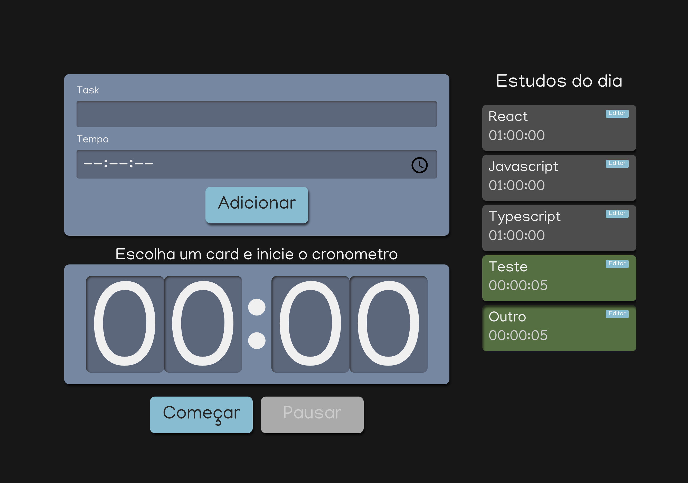

# Alura Studies

Projeto criado a partir dos estudos do curso [React: escrevendo com Typescript](https://cursos.alura.com.br/course/react-modernizando-escrever-typescript)

## Comandos disponíveis

3. `npm start`: Inicia o servidor de desenvolvimento e abre o projeto no navegador.
4. `npm run build`: Compila o aplicativo para produção na pasta "build".
5. `npm test`: Inicia a execução dos testes.
6. `npm run eject`: Remove a dependência do create-react-app e permite personalizar a configuração do projeto.
7. `npm run lint`: Executa a verificação de linting no código.
8. `npm run format`: Formata o código usando as regras de formatação definidas.
9. `npm run deploy`: Implanta o aplicativo em um provedor de hospedagem estática, como GitHub Pages.
